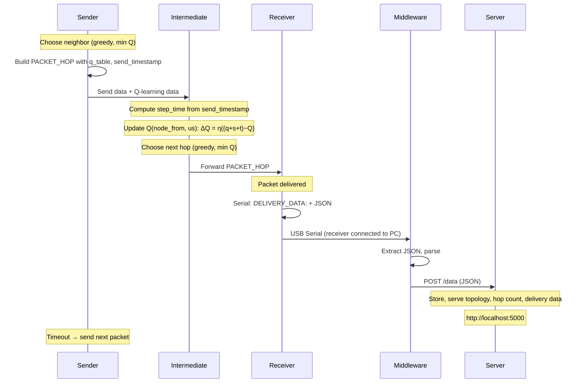

# Mesh Routing with Q-Routing (TD(0))

This project implements a mesh network routing system using **Q-Routing** as described in Boyan & Littman (1994), *Packet Routing in Dynamically Changing Networks: A Reinforcement Learning Approach*. The algorithm uses **TD(0) temporal-difference updates** to minimize packet delivery time. Implemented with ESP devices and the painlessMesh library.

Each ESP device handles packet reception and transmission in the mesh network. The routing logic minimizes **estimated delivery time**. Q-values represent the estimated time to deliver a packet to the destination via each neighbor—**lower Q means a better path**.

## Node Roles

| Role | File | Behavior |
|------|------|----------|
| **Sender** | `sender-node.ino` | Sends packets on a timer, chooses first hop, forwards packets |
| **Intermediate** | `intermediate-node.ino` | Forwards packets, updates Q-table at each hop |
| **Receiver** | `receiver-node.ino` | Packet destination; receives and logs delivery |



**Forward-only flow:** No backward propagation. Q-updates happen at each hop when forwarding. Receiver does not broadcast; sender sends packets on a timer.

**Visualization (optional):** When the receiver is connected via USB to a PC, it outputs `DELIVERY_DATA:` + JSON on Serial. The middleware reads this, extracts the JSON, and forwards it to the visualization server. Open http://localhost:5000 for topology, hop count per delivered packet, and delivery data.

## How the Learning Works

### Q-Values

- **Q(from, to)** = estimated time to deliver a packet from the current node to the destination via neighbor `to`
- **Lower Q** = faster path = better choice

### Update Rule (Boyan & Littman 1994)

When a packet arrives from node `x` and we forward it, we update the link that was traversed:

```
ΔQ_x(d,y) = η × ((q + s + t) - Q_x(d,y))
```

Where:
- **q** = time in queue (0). AsyncTCP exposes only send-buffer info (`space()`, `canSend()`), not receive queue size or per-packet queue delay. painlessMesh does not expose the underlying TCP connections. We cannot measure queue time without an application-level queue.
- **s** = transmission time (measured via `send_timestamp` in the packet)
- **t** = our estimate of remaining time = min over our neighbors of Q(us, neighbor)
- **η** = learning rate (eta, default 0.7)

### Action Selection

- **Greedy:** Always choose the neighbor with the **minimum** Q-value

### Flow

1. **Sender** sends a packet, picks first hop, sends `PACKET_HOP` with `send_timestamp`
2. **Intermediate** receives, computes step_time from `send_timestamp`, updates Q(node_from, us), picks next hop, forwards
3. **Receiver** receives; packet is delivered (no further action)
4. **Sender** sends the next packet after a timeout (no callback)

## Message Structure

Only **PACKET_HOP** messages are used. Structure:

```json
{
    "type": "PACKET_HOP",
    "current_node_id": "434960473",
    "send_timestamp": 12345678,
    "hyperparameters": {
        "eta": 0.7
    },
    "current_episode": 1,
    "accumulated_reward": 0,
    "episodes": [
        {
            "episode_number": 1,
            "steps": [
                {
                    "hop": 0,
                    "node_from": "434939008",
                    "node_to": "434960473"
                }
            ]
        }
    ],
    "q_table": {
        "434939008": { "434960473": 0.5 },
        "434960473": { "434939008": 0.3 }
    }
}
```

- **send_timestamp** (µs): Used by the receiver to compute actual transmission time
- **q_table**: Q(from, to) = estimated delivery time; lower = better
- **episodes** (legacy naming): Tracks delivered packets; each entry = one path (steps) from sender to receiver

## Setup

**Hardware:** 2+ ESP8266 devices (sender, receiver, and optionally intermediate nodes)

**Dependencies:** `painlessMesh`, `TaskScheduler`, `ArduinoJson`, `AsyncTCP`

### Build

**PlatformIO** (recommended):
```bash
pio run -e sender      # Build sender firmware
pio run -e intermediate # Build intermediate firmware
pio run -e receiver    # Build receiver firmware
```

**Arduino IDE:** Each sketch must be in its own folder with a matching name (e.g. `sender-node/sender-node.ino`). Copy the corresponding `.ino` file into a new folder and open it.

### Flash

- `sender-node.ino` → sender node
- `intermediate-node.ino` → intermediate nodes
- `receiver-node.ino` → receiver (destination) node

1. Flash all nodes
2. Power on the receiver first, then intermediate(s), then sender
3. The sender sends packets on a timer; packets flow sender → intermediate(s) → receiver

### Visualization (optional)

Connect the **receiver** via USB to a PC to visualize learning progress:

```bash
# Terminal 1: Start visualization server
cd learning-visualization-server && pip install -r requirements.txt && python server.py

# Terminal 2: Start middleware (receiver connected via USB)
cd learning-results-grabbing && pip install -r requirements.txt && python middleware.py --verbose
```

Open http://localhost:5000 for topology, hop count per delivered packet, and delivery data.

## Configuration

| Parameter | Default | Description |
|-----------|---------|-------------|
| `eta` | 0.7 | Learning rate |
| `INITIAL_Q` | 0.0 | Initial Q-value (lower = better) |

## References

- Boyan, J. A., & Littman, M. L. (1994). *Packet Routing in Dynamically Changing Networks: A Reinforcement Learning Approach*
- [meshroutingframework](https://github.com/yourusername/meshroutingframework) — Java simulation with the same Q-routing logic

## Demos

Demo 1:
[](https://youtu.be/WYOyJp7k9bQ)

Demo 2:
[](https://youtu.be/fHp0AZggZRo)
