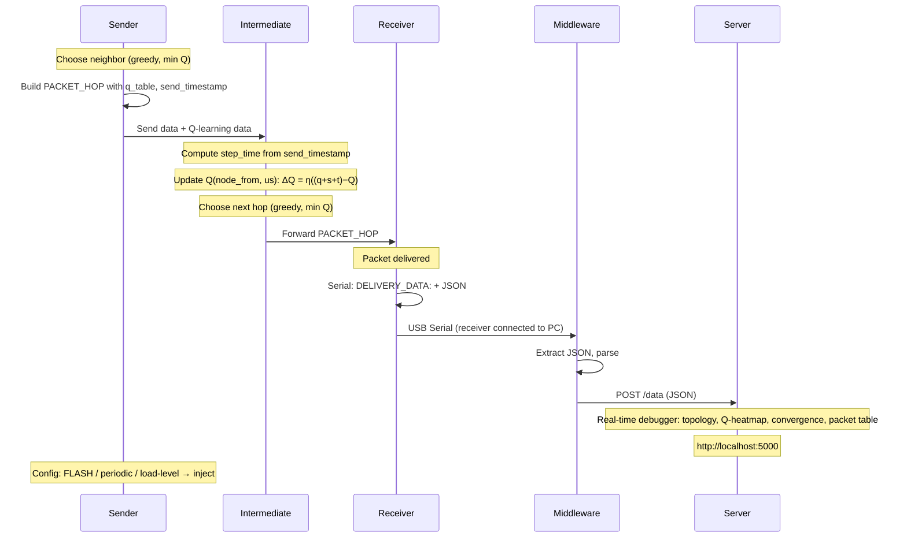
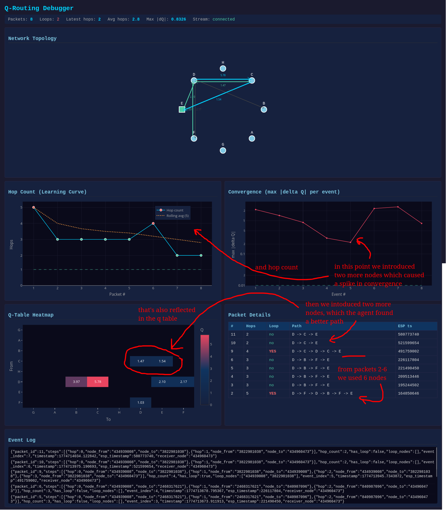

# Mesh Routing with Q-Routing (TD(0))

This project implements a mesh network routing system using **Q-Routing** as described in Boyan & Littman (1994), *Packet Routing in Dynamically Changing Networks: A Reinforcement Learning Approach*. The algorithm uses **TD(0) temporal-difference updates** to minimize packet delivery time. Implemented with ESP devices and the painlessMesh library.

Each ESP device handles packet reception and transmission in the mesh network. The routing logic minimizes **estimated delivery time**. Q-values represent the estimated time to deliver a packet to the destination via each neighbor—**lower Q means a better path**.

## Project layout

| Path | Contents |
|------|----------|
| `firmware/` | ESP8266 sketches—one folder per node (folder name = main `.ino` basename for Arduino CLI) |
| `data/` | LittleFS image source (sender): `injection-schedule.json` — upload with PlatformIO `uploadfs` |
| `tools/` | Host-side Python: serial middleware (`learning-results-grabbing`) and real-time visualization server (`learning-visualization-server`) |

## Node Roles

| Role | File | Behavior |
|------|------|----------|
| **Sender** | `firmware/sender-node/sender-node.ino` | Packet injection schedule from LittleFS (`data/injection-schedule.json`): **FLASH** only, **periodic**, or **load-level** stochastic; then greedy first hop |
| **Intermediate** | `firmware/intermediate-node/intermediate-node.ino` | Forwards packets, updates Q-table at each hop |
| **Receiver** | `firmware/receiver-node/receiver-node.ino` | Packet destination; receives and logs delivery |


```mermaid
sequenceDiagram
    participant Sender
    participant Intermediate
    participant Receiver
    participant Middleware
    participant Server

    Note over Sender: Choose neighbor (greedy, min Q)
    Sender->>Sender: Build PACKET_HOP with q_table, send_timestamp
    Sender->>Intermediate: Send data + Q-learning data

    Note over Intermediate: Compute step_time from send_timestamp
    Note over Intermediate: Update Q(node_from, us): ΔQ = η((q+s+t)−Q)
    Note over Intermediate: Choose next hop (greedy, min Q)
    Intermediate->>Receiver: Forward PACKET_HOP

    Note over Receiver: Packet delivered
    Receiver->>Receiver: Serial: DELIVERY_DATA: + JSON
    Receiver->>Middleware: USB Serial (receiver connected to PC)
    Middleware->>Middleware: Extract JSON, parse
    Middleware->>Server: POST /data (JSON)
    Note over Server: Real-time debugger: topology, Q-heatmap, convergence, packet table
    Note over Server: http://localhost:5000

    Note over Sender: Config: FLASH / periodic / load-level → inject
```

**Forward-only flow:** No backward propagation. Q-updates happen at each hop when forwarding. Receiver does not broadcast. The sender’s **injection schedule** (LittleFS JSON) selects **PHYSICAL_BUTTON_DRIVEN** (FLASH on GPIO0), **PERIODIC** (one packet every `tick_ms`), or **LOAD_LEVEL** (expected `load_level` packets per `tick_ms`, stochastic rounding). If the file is missing or invalid, defaults match **PHYSICAL_BUTTON_DRIVEN**.


**Visualization (optional):** When the receiver is connected via USB to a PC, it outputs `DELIVERY_DATA:` + JSON on Serial. The middleware reads this, extracts the JSON, and forwards it to the visualization server. Open http://localhost:5000 for the real-time Q-Routing Debugger — topology, learning curves, Q-table heatmap, convergence tracking, packet details, and event log, all updating live via SSE.

## How the Learning Works

### Q-Values

- **Q(from, to)** = estimated time to deliver a packet from the current node to the destination via neighbor `to`
- **Lower Q** = faster path = better choice

### Update Rule (Boyan & Littman 1994)

When a packet arrives from node `x` and we forward it, we update the link that was traversed:

```
ΔQ_x(d,y) = η × ((q + s + t) - Q_x(d,y))
```

Where:
- **q** = time in queue (0). AsyncTCP exposes only send-buffer info (`space()`, `canSend()`), not receive queue size or per-packet queue delay. painlessMesh does not expose the underlying TCP connections. We cannot measure queue time without an application-level queue.
- **s** = transmission time (measured via `send_timestamp` in the packet)
- **t** = our estimate of remaining time = min over our neighbors of Q(us, neighbor)
- **η** = learning rate (eta, default 0.7)

### Action Selection

- **Greedy:** Always choose the neighbor with the **minimum** Q-value

### Flow

1. **Sender** sends a packet, picks first hop, sends `PACKET_HOP` with `send_timestamp`
2. **Intermediate** receives, computes step_time from `send_timestamp`, updates Q(node_from, us), picks next hop, forwards
3. **Receiver** receives; packet is delivered (no further action)
4. **Sender** injects the next packet per its schedule (button, timer, or load level — no delivery callback)

## Message Structure

Only **PACKET_HOP** messages are used. Structure:

```json
{
    "type": "PACKET_HOP",
    "current_node_id": "434960473",
    "send_timestamp": 12345678,
    "hyperparameters": {
        "eta": 0.7
    },
    "current_packet_id": 1,
    "packets": [
        {
            "packet_id": 1,
            "steps": [
                {
                    "hop": 0,
                    "node_from": "434939008",
                    "node_to": "434960473"
                }
            ]
        }
    ],
    "q_table": {
        "434939008": { "434960473": 0.5 },
        "434960473": { "434939008": 0.3 }
    }
}
```

- **send_timestamp** (µs): Used by the receiver to compute actual transmission time
- **q_table**: Q(from, to) = estimated delivery time; lower = better
- **packets**: One object per injected packet; **packet_id** identifies it; **steps** list the hop path from sender toward the receiver

## Setup

### Hardware

- 2+ ESP8266 devices
  - `firmware/sender-node/` → sender
  - `firmware/intermediate-node/` → intermediate
  - `firmware/receiver-node/` → receiver
- Micro-USB data cable
- Linux machine with `arduino-cli`

### Arduino CLI setup on Linux

Install `arduino-cli` and configure the ESP8266 core:

```bash
$ arduino-cli config init
```

Edit `~/.arduino15/arduino-cli.yaml` and add:

```yaml
board_manager:
  additional_urls:
    - https://arduino.esp8266.com/stable/package_esp8266com_index.json
```

Then install the ESP8266 core:

```bash
$ arduino-cli core update-index
$ arduino-cli core install esp8266:esp8266
```

Install required libraries:

```bash
$ arduino-cli lib update-index
$ arduino-cli lib install "Painless Mesh"
$ arduino-cli lib install ESPAsyncTCP
$ arduino-cli lib install ArduinoJson
```

## Detect the board

Connect the ESP8266 through USB and verify that the OS detects it:

```bash
$ lsusb
$ arduino-cli board list
```

A NodeMCU board typically appears as something like:

```bash
$ /dev/ttyUSB0 serial Serial Port (USB)
```

## Compile

For NodeMCU ESP8266, use:

```bash
$ arduino-cli compile --fqbn esp8266:esp8266:nodemcuv2 ./firmware/sender-node
$ arduino-cli compile --fqbn esp8266:esp8266:nodemcuv2 ./firmware/intermediate-node
$ arduino-cli compile --fqbn esp8266:esp8266:nodemcuv2 ./firmware/receiver-node
```

### PlatformIO (optional)

From the repository root, each sketch is a separate environment (`src_dir` points at `firmware/<node>/`):

```bash
pio run -e sender -e intermediate -e receiver
```

**Sender filesystem (injection schedule):** Edit `data/injection-schedule.json`, then upload LittleFS to the **sender** board:

```bash
pio run -e sender -t uploadfs
```

If you skip `uploadfs`, the sender uses built-in defaults (FLASH-driven injection).

## Upload

Upload each sketch to the corresponding board:

```bash
$ arduino-cli upload -p /dev/ttyUSB0 --fqbn esp8266:esp8266:nodemcuv2 ./firmware/sender-node
$ arduino-cli upload -p /dev/ttyUSB0 --fqbn esp8266:esp8266:nodemcuv2 ./firmware/intermediate-node
$ arduino-cli upload -p /dev/ttyUSB0 --fqbn esp8266:esp8266:nodemcuv2 ./firmware/receiver-node
```

## Serial monitoring

To inspect logs from a node, use arduino-cli monitor.

Example for baudrate 9600:

```bash
$ arduino-cli monitor -p /dev/ttyUSB0 -c baudrate=9600
```
## Network bring-up order

1. Power on the receiver
2. Power on any intermediate nodes
3. Power on the sender

The sender injects packets per **`data/injection-schedule.json`** (e.g. FLASH, periodic, or load level); intermediate nodes forward packets and update Q-values; the receiver logs deliveries.

**Important:** Routing is **one-shot** over the **current** painlessMesh neighbor graph. If you inject a packet **before** the receiver has joined Wi‑Fi mesh, **no node has the receiver as a neighbor yet**, so nothing can forward to it. Wait until all nodes show up in the mesh (or follow the order above), **then** inject. A new packet after the receiver is online will work; the old packet does not wait.

**Troubleshooting “receiver never sees the packet”:** (1) Confirm bring-up order — receiver on the mesh before injection. (2) Confirm the graph is connected (every node can reach every other via mesh hops). (3) If the serial log shows `Failed to parse message` on intermediates, the JSON may be too large — firmware uses an 8 KiB buffer for `PACKET_HOP` (`PACKET_JSON_CAPACITY`).

### Visualization (optional)

Connect the **receiver** via USB to a PC to visualize learning progress in real time:

```bash
# Terminal 1: Start visualization server
cd tools/learning-visualization-server && pip install -r requirements.txt && python server.py

# Terminal 2: Start middleware (receiver connected via USB)
cd tools/learning-results-grabbing && pip install -r requirements.txt && python middleware.py --verbose
```

Open http://localhost:5000 for the **Q-Routing Debugger** — a real-time dashboard with six views:

| View | What it shows |
|------|---------------|
| **Network Topology** | Directed graph with Q-value edge labels. Green edges = preferred next-hop (argmin Q). Blue = latest packet path. Red = loop edges. Sender (diamond), receiver (square) visually distinct. Short node labels (A-F), full ID on hover. |
| **Hop Count (Learning Curve)** | Hops per packet with rolling average (window=5). Green markers = clean delivery, red = loop detected. Dashed line at y=1 shows theoretical optimum. |
| **Convergence** | max |delta Q| per event on log scale. Trends toward zero as learning stabilizes. Dashed threshold at 0.01. |
| **Q-Table Heatmap** | NxN grid (from/to) colored by Q-value intensity. Shows which edges have been explored and current value landscape. |
| **Packet Details** | Table with packet #, hop count, loop flag, path (short labels), and ESP timestamp. Newest first. |
| **Event Log** | Last 20 raw events for debugging data flow. |

The dashboard updates automatically via Server-Sent Events (SSE) — no browser refresh needed. A status bar shows live packet count, loop count, latest/average hops, max |dQ|, and SSE connection state.

On restart, the server replays `received_data.log` to rebuild state, so no data is lost between sessions.




## Configuration

### Sender: `data/injection-schedule.json` (LittleFS)

Stored as JSON (same fields as a YAML `injection_schedule` block). Upload with `pio run -e sender -t uploadfs`.

```json
{
  "injection_schedule": {
    "mode": "PHYSICAL_BUTTON_DRIVEN",
    "tick_ms": 10000,
    "load_level": 2.4,
    "seed": 42
  }
}
```

| Field | Meaning |
|-------|--------|
| `mode` | `PHYSICAL_BUTTON_DRIVEN` — inject on FLASH press. `PERIODIC` — one packet every `tick_ms`. `LOAD_LEVEL` — each `tick_ms`, inject `floor(L)` packets plus one extra with probability `L - floor(L)` (expected rate `L` per tick). |
| `tick_ms` | Interval for `PERIODIC` / `LOAD_LEVEL` (minimum enforced in firmware: 100 ms). |
| `load_level` | Mean packets per tick for `LOAD_LEVEL` (`L` ≥ 0). |
| `seed` | RNG seed for load-level draws; `0` = non-reproducible seed at boot. |

Per tick, load-level injection count is capped (firmware constant) to avoid flooding the mesh.

### Firmware constants

| Parameter | Default | Description |
|-----------|---------|-------------|
| `eta` | 0.7 | Learning rate |
| `INITIAL_Q` | 0.0 | Initial Q-value (lower = better) |
| `FLASH_BUTTON_PIN` (sender) | `0` | NodeMCU FLASH → GPIO0; override if your board uses another pin (`#define` before compile) |
| `FLASH_DEBOUNCE_MS` (sender) | `300` | Minimum time between injects on repeated edges (button mode) |

## References

- Boyan, J. A., & Littman, M. L. (1994). *Packet Routing in Dynamically Changing Networks: A Reinforcement Learning Approach*
- [meshroutingframework](https://github.com/yourusername/meshroutingframework) — Java simulation with the same Q-routing logic

## Demos

Demo 1:
[](https://youtu.be/WYOyJp7k9bQ)

Demo 2:
[](https://youtu.be/fHp0AZggZRo)
